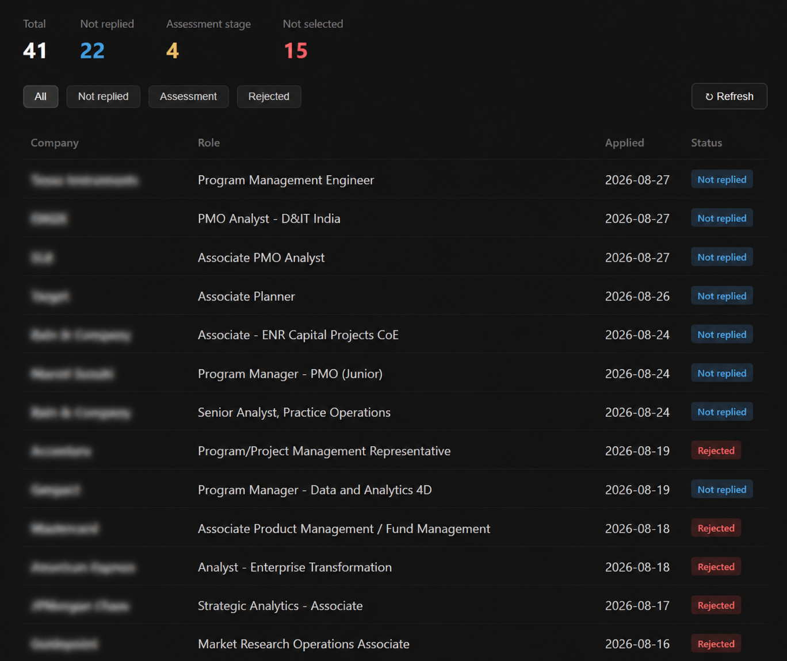

# Job Application Tracking Dashboard

## Motivation
While actively applying to dozens of positions across multiple platforms and corporate portals, keeping track of application statuses, assessment invites, and follow-ups manually became cluttered and overwhelming[cite: 1, 2, 4]. 

To solve this, I built a lightweight, self-hosted dashboard that connects directly to my personal Google account via Google APIs. It automatically scans incoming emails for status changes (rejections, test invitations, interview rounds) and updates a local database so I can monitor all my application metrics in one clean view[cite: 1, 2, 4].

---
### Dashboard Preview
*Here is how the dashboard looks in action:*


## Tech Stack & Architecture

- **Frontend**: Vanilla HTML5, CSS3, and JavaScript (fetch API, responsive UI, dynamic metric filtering)[cite: 1, 2, 4].
- **Backend Framework**: Python (Flask).
- **Database**: SQLite (`data/dashboard.db`) for persistent offline storage[cite: 1, 2].
- **Integration**: Google Gmail API (`google-api-python-client`, `google-auth-oauthlib`) for parsing application updates[cite: 1, 2].

---

## APIs & Integration Details

### 1. Google Gmail API (`gmail.readonly`)
- **OAuth 2.0 Authorization**: Securely authenticates with Google via PKCE/OAuth consent[cite: 1].
- **Message List Query (`gmail.users().messages().list`)**: Queries your inbox for messages containing application updates, company base names, or status keywords[cite: 1, 2].
- **Message Payload Fetch (`gmail.users().messages().get`)**: Retrieves plain-text email bodies and subject headers to run deterministic regular expression (RegEx) pattern matching[cite: 1, 2].

### 2. Internal Flask REST API Endpoints

| Endpoint | Method | Description |
| :--- | :--- | :--- |
| `GET /` | `GET` | Serves the main HTML dashboard interface (`public/index.html`)[cite: 1, 2, 4]. |
| `GET /api/state` | `GET` | Returns all current job application records stored in the SQLite database[cite: 1, 2, 4]. |
| `POST /api/refresh` | `POST` | Triggers the Gmail API fetcher to scan recent emails, run status classification, and update modified application statuses in SQLite[cite: 1, 2]. |
| `POST /api/webhook` | `POST` | *(Optional)* Endpoint for receiving real-time incoming status updates pushed from external scripts or triggers[cite: 1, 2]. |

---

## Project Structure

```text
├── app.py                 # Core Flask backend, SQLite schema, & Gmail API classification logic[cite: 1, 2]
├── data/
│   ├── applications.json  # Initial seed dataset of target applications[cite: 2, 4]
│   └── dashboard.db       # SQLite database file (created on runtime)[cite: 1, 2]
├── public/
│   └── index.html         # Frontend dashboard UI (metrics, filtering table)[cite: 1, 2, 4]
├── .gitignore             # Excludes sensitive tokens, local DBs, and Python cache files[cite: 1, 2]
└── README.md